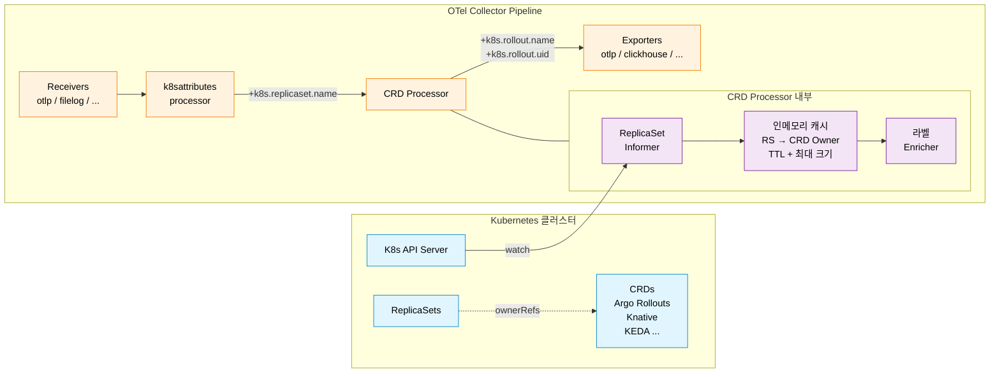

<div align="center">


# K-O11y OTel Collector

**K-O11y OTel Collector — Kubernetes CRD 라벨로 원격측정 데이터를 보강하는 CRD Processor 탑재 OpenTelemetry Collector**

[English](README.md) | [한국어](README.ko.md)

[](https://www.repostatus.org/#wip)
[](LICENSE)
[](https://github.com/open-telemetry/opentelemetry-collector/releases/tag/v0.109.0)
[](https://go.dev/)

[OpenTelemetry Collector v0.109.0](https://github.com/open-telemetry/opentelemetry-collector/releases/tag/v0.109.0) 기반.

[K-O11y](https://github.com/Wondermove-Inc/k-o11y) 스택의 구성 요소.

</div>

---

## ✨ 주요 기능

- 🏷️ **CRD Processor** — Kubernetes CRD 라벨(예: `k8s.rollout.name`)을 traces, metrics, logs에 자동 추가
- 🚀 **Argo Rollouts 지원** — Argo Rollouts 워크로드 기본 인식
- 🧩 **확장 가능** — 설정만으로 다른 CRD(Knative, KEDA 등) 지원 추가
- ⚡ **K8s Informer 기반** — API 서버 부하를 최소화하는 이벤트 기반 캐싱
- 📦 **OTel Collector v0.109.0** — K-O11y에 맞게 선별된 Receivers / Processors / Exporters / Extensions 배포판
- 🐳 **멀티 아키텍처 Docker 이미지** — `make docker`로 `linux/amd64`, `linux/arm64` 동시 배포

---

## 🏗️ 동작 원리

CRD Processor는 Kubernetes Informer로 `ReplicaSet` 리소스를 감시하고, 각 ReplicaSet의 `ownerReferences`를 따라 최상위 커스텀 리소스(예: Argo Rollout)까지 확인한 뒤, 그 매핑을 인메모리 캐시에 저장합니다. 파이프라인을 통과하는 원격측정 데이터에 `k8s.replicaset.name` 속성(`k8sattributes` 프로세서가 주입)이 붙어 있으면, CRD Processor가 이를 조회해서 CRD 소유자 라벨을 추가합니다 — span마다 별도의 API 호출 없이요.



**데이터 흐름**:

1. K8s Informer가 클러스터 전역의 `ReplicaSet` 리소스를 감시
2. 각 ReplicaSet의 `ownerReferences`를 확인하여 설정된 CRD(예: `argoproj.io/Rollout`) 조회
3. ReplicaSet → CRD Owner 매핑을 TTL/최대 크기가 설정된 인메모리 캐시에 보관
4. `k8s.replicaset.name`(by `k8sattributes`)이 포함된 원격측정 데이터에 `k8s.rollout.name`, `k8s.rollout.uid` 같은 라벨 보강
5. 오류 발생 시 `passthrough_on_error` 설정으로 데이터가 차단되지 않고 계속 흐르게 할 수 있음

---

## 🧩 컴포넌트

OpenTelemetry Collector v0.109.0 기반의 선별된 컴포넌트 세트.

### Receivers (7개)

| Receiver | 소스 | 설명 |
|----------|------|------|
| `otlp` | Core | OTLP gRPC/HTTP 수신기 |
| `filelog` | Contrib | 파일 로그 수신기 |
| `hostmetrics` | Contrib | 호스트 메트릭 수신기 (CPU, 메모리, 디스크, 네트워크) |
| `k8s_cluster` | Contrib | Kubernetes 클러스터 메트릭 (노드, 파드, 디플로이먼트) |
| `k8s_events` | Contrib | Kubernetes 이벤트 수신기 |
| `kubeletstats` | Contrib | Kubelet 통계 수신기 |
| `prometheus` | Contrib | Prometheus 스크래핑 수신기 |

### Processors (10개)

| Processor | 소스 | 설명 |
|-----------|------|------|
| `batch` | Core | 텔레메트리 데이터 배치 처리 |
| `memory_limiter` | Core | OOM 방지를 위한 메모리 제한 |
| `attributes` | Contrib | 리소스/스팬 속성 수정 |
| `filter` | Contrib | 텔레메트리 데이터 필터링 |
| `k8sattributes` | Contrib | Kubernetes 메타데이터 추가 |
| `metricstransform` | Contrib | 메트릭 이름 및 라벨 변환 |
| `resource` | Contrib | 리소스 속성 수정 |
| `resourcedetection` | Contrib | 호스트/클라우드 환경 자동 감지 |
| `transform` | Contrib | OTTL 기반 데이터 변환 |
| **`crd`** | **Custom** | **CRD 소유자 라벨 추가 (예: `k8s.rollout.name`)** |

### Exporters (4개)

| Exporter | 소스 | 설명 |
|----------|------|------|
| `otlp` | Core | OTLP gRPC 익스포터 |
| `otlphttp` | Core | OTLP HTTP 익스포터 |
| `debug` | Core | 콘솔 디버그 출력 |
| `clickhouse` | Contrib | ClickHouse 데이터베이스 익스포터 |

### Extensions (3개)

| Extension | 소스 | 설명 |
|-----------|------|------|
| `zpages` | Core | zPages 디버깅 익스텐션 |
| `health_check` | Contrib | 헬스체크 엔드포인트 (13133 포트) |
| `pprof` | Contrib | Go pprof 프로파일링 엔드포인트 |

---

## ⚙️ 설정

### CRD Processor

```yaml
processors:
  crd:
    # ReplicaSet -> Owner 매핑 캐시 TTL
    cache_ttl: 60s

    # 최대 캐시 엔트리 수
    cache_max_size: 10000

    # K8s API 호출 타임아웃 (초기 동기화 시)
    api_timeout: 10s

    # 오류 발생 시 데이터 통과 허용
    passthrough_on_error: true

    # 지원할 CRD 목록
    custom_resources:
      - group: argoproj.io
        version: v1alpha1
        kind: Rollout
        label_prefix: k8s.rollout

      # 필요시 다른 CRD 추가
      # - group: serving.knative.dev
      #   version: v1
      #   kind: Revision
      #   label_prefix: k8s.knative.revision
```

### 파이프라인

조회에 필요한 `k8s.replicaset.name`이 준비되도록 `crd`는 반드시 `k8sattributes` **뒤에** 배치합니다.

```yaml
service:
  pipelines:
    traces:
      receivers: [otlp]
      processors: [k8sattributes, crd, batch]  # crd는 k8sattributes 뒤에
      exporters: [otlp]
    metrics:
      receivers: [otlp]
      processors: [k8sattributes, crd, batch]
      exporters: [otlp]
    logs:
      receivers: [otlp]
      processors: [k8sattributes, crd, batch]
      exporters: [otlp]
```

---

## 📁 프로젝트 구조

```
k-o11y-otel-collector/
├── cmd/otelcol/
│   ├── main.go           # 엔트리포인트
│   └── components.go     # 컴포넌트 등록
├── processor/crdprocessor/
│   ├── config.go         # 설정 구조체
│   ├── factory.go        # 팩토리 함수
│   ├── processor.go      # 핵심 프로세서 로직
│   ├── cache.go          # K8s Informer 캐시
│   ├── config_test.go    # 설정 테스트
│   ├── factory_test.go   # 팩토리 테스트
│   ├── processor_test.go # 프로세서 테스트
│   └── cache_test.go     # 캐시 테스트
├── Makefile
├── Dockerfile
├── go.mod
└── README.md
```

---

## 🛠️ 빌드

### 사전 요구사항

- Go 1.22+
- Docker (컨테이너 빌드용)
- kubectl (K8s 테스트용)

### 바이너리

```bash
# 현재 플랫폼용 빌드
make build

# 모든 플랫폼용 빌드 (linux/darwin × amd64/arm64)
make build-all
```

### Docker 이미지

```bash
# 멀티 아키텍처 이미지 빌드 및 푸시
# → ghcr.io/wondermove-inc/k-o11y-otel-collector-contrib:0.109.0.1
make docker

# 로컬 빌드 (단일 아키텍처, 푸시 없음)
make docker-local
```

### 테스트

```bash
# 테스트 실행
make test

# 커버리지 포함 테스트
make test-coverage
```

**테스트 현황**: 43개 단위 테스트 · 커버리지 72.3%.

---

## 🔒 RBAC 요구사항

CRD Processor는 클러스터 전역의 `ReplicaSet` 리소스에 대한 읽기 권한이 필요합니다:

```yaml
apiVersion: rbac.authorization.k8s.io/v1
kind: ClusterRole
metadata:
  name: otel-collector-crd
rules:
  - apiGroups: ["apps"]
    resources: ["replicasets"]
    verbs: ["get", "list", "watch"]
```

`custom_resources`에 추가되는 CRD에 따라 다른 `apiGroups` 권한이 필요할 수 있습니다.

---

## 🐛 트러블슈팅

### CRD 라벨이 나타나지 않을 때

1. 원격측정 데이터에 `k8s.replicaset.name`이 있는지 확인 — `k8sattributes` 프로세서가 `crd` **앞에** 있어야 합니다
2. ServiceAccount가 ReplicaSet에 대한 `get`/`list`/`watch` RBAC 권한을 가지고 있는지 확인
3. 프로세서 로그에서 캐시 동기화 상태 확인 — 콜드 스타트 시 Informer가 전체 리스트를 한 번 받아옵니다
4. 설정의 CRD `kind`가 실제 리소스 kind와 정확히 일치하는지 확인 (대소문자 구분)

### 메모리 사용량이 높을 때

캐시 상한 조정:

```yaml
processors:
  crd:
    cache_max_size: 5000
```

### 시작이 느릴 때

Informer가 시작 시 모든 ReplicaSet을 한 번에 리스트업합니다. 대규모 클러스터에서는 수십 초 걸릴 수 있으며, pod당 최초 1회만 발생하는 정상 동작입니다.

---

## 🤝 기여하기

기여는 언제나 환영합니다. 특히 [good first issue](https://github.com/search?q=org%3AWondermove-Inc+label%3A%22good+first+issue%22+is%3Aopen&type=issues) 라벨이 붙은 이슈부터 시작해보세요.

1. **이슈 찾기** — `good first issue` 또는 `help wanted` 라벨 확인
2. **이슈에 댓글** — 작업 의사를 밝혀 중복 작업을 피합니다
3. **Fork → branch → PR** — 범위는 좁게, 설명은 명확하게
4. **리뷰 반영** — 메인테이너가 수 일 이내 답변합니다

자세한 내용은 [CONTRIBUTING.md](CONTRIBUTING.md)와 [SECURITY.md](SECURITY.md)를 참고하세요.

본 프로젝트는 **passive maintenance** 모델입니다 — PR과 이슈는 시간이 허락하는 대로 검토됩니다. 7일 내 응답을 목표로 하지만 보장하지는 않습니다.

---

## 🌐 관련 프로젝트

[K-O11y](https://github.com/Wondermove-Inc/k-o11y) 관측성 스택의 구성 요소:

- 🧠 [k-o11y-server](https://github.com/Wondermove-Inc/k-o11y-server) — 설치형 관측성 백엔드 (SigNoz 포크 + ko11y-core)
- 📦 [k-o11y-install](https://github.com/Wondermove-Inc/k-o11y-install) — Helm 차트 + Go CLI 설치 도구
- 📡 **k-o11y-otel-collector** (본 레포) — CRD Processor 탑재 OTel Collector
- 🛂 [k-o11y-otel-gateway](https://github.com/Wondermove-Inc/k-o11y-otel-gateway) — License Guard 탑재 SigNoz OTel Collector 포크

---

## 📄 라이선스

Apache License 2.0 — [LICENSE](LICENSE) 참조.

[OpenTelemetry Collector](https://github.com/open-telemetry/opentelemetry-collector) (Apache 2.0) 포크. 상세 출처는 [NOTICE](NOTICE) 파일을 참고하세요.

---

<div align="center">

**[Wondermove](https://wondermove.net)가 개발 및 관리합니다**

[OpenTelemetry](https://opentelemetry.io) 커뮤니티의 훌륭한 작업에 기반합니다.

</div>
