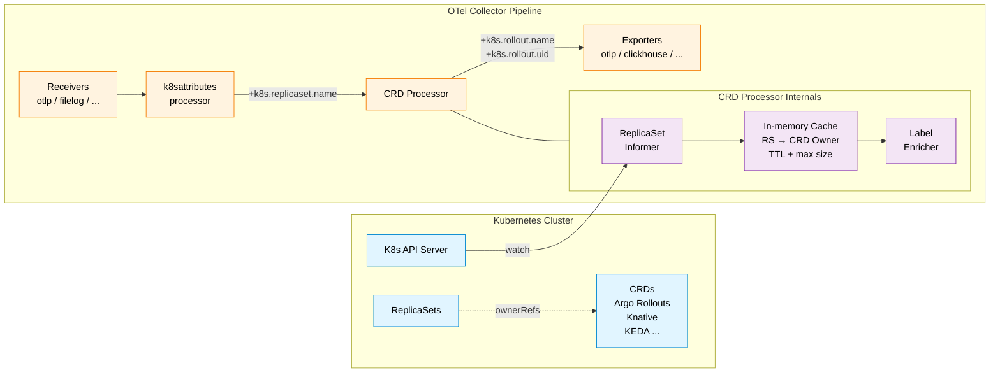

<div align="center">


# K-O11y OTel Collector

**K-O11y OTel Collector — OpenTelemetry Collector with a CRD Processor that enriches telemetry with Kubernetes CRD labels.**

[English](README.md) | [한국어](README.ko.md) | [日本語](README.ja.md) | [中文](README.zh-CN.md)

[](https://www.repostatus.org/#wip)
[](LICENSE)
[](https://github.com/open-telemetry/opentelemetry-collector/releases/tag/v0.109.0)
[](https://go.dev/)

Built on [OpenTelemetry Collector v0.109.0](https://github.com/open-telemetry/opentelemetry-collector/releases/tag/v0.109.0).

Part of the [K-O11y](https://github.com/Wondermove-Inc/k-o11y) stack.

</div>

---

## ✨ Features

- 🏷️ **CRD Processor** — Automatically adds Kubernetes CRD labels (e.g. `k8s.rollout.name`) to traces, metrics, and logs
- 🚀 **Argo Rollouts Support** — Built-in recognition for Argo Rollouts workloads
- 🧩 **Extensible** — Add support for additional CRDs (Knative, KEDA, etc.) via configuration
- ⚡ **K8s Informer-based** — Efficient event-driven caching that minimizes API server load
- 📦 **OTel Collector v0.109.0** — Curated distribution with Receivers, Processors, Exporters, and Extensions ready for K-O11y
- 🐳 **Multi-arch Docker images** — `linux/amd64` and `linux/arm64` published via `make docker`

---

## 🏗️ How It Works

The CRD Processor runs a Kubernetes Informer that watches `ReplicaSet` resources, resolves each one's `ownerReferences` up to a custom resource (e.g. an Argo Rollout), and keeps the mapping in an in-memory cache. When telemetry flows through the pipeline with a `k8s.replicaset.name` attribute (set by the `k8sattributes` processor), the CRD Processor looks it up and attaches CRD owner labels — without any extra API round-trips per span.



**Data flow**:

1. A K8s Informer watches `ReplicaSet` resources cluster-wide
2. For each ReplicaSet, `ownerReferences` are inspected for configured CRDs (e.g. `argoproj.io/Rollout`)
3. ReplicaSet → CRD owner mappings are kept in an in-memory cache with configurable TTL and max size
4. Telemetry carrying `k8s.replicaset.name` (injected by `k8sattributes`) is enriched with labels like `k8s.rollout.name` and `k8s.rollout.uid`
5. On errors, `passthrough_on_error` lets data continue unblocked

---

## 🧩 Components

Curated component set on top of OpenTelemetry Collector v0.109.0.

### Receivers (7)

| Receiver | Source | Description |
|----------|--------|-------------|
| `otlp` | Core | OTLP gRPC/HTTP receiver |
| `filelog` | Contrib | File log receiver |
| `hostmetrics` | Contrib | Host metrics (CPU, memory, disk, network) |
| `k8s_cluster` | Contrib | Kubernetes cluster metrics (nodes, pods, deployments) |
| `k8s_events` | Contrib | Kubernetes events receiver |
| `kubeletstats` | Contrib | Kubelet stats receiver |
| `prometheus` | Contrib | Prometheus scraping receiver |

### Processors (10)

| Processor | Source | Description |
|-----------|--------|-------------|
| `batch` | Core | Batch telemetry data |
| `memory_limiter` | Core | Memory limiter to prevent OOM |
| `attributes` | Contrib | Modify resource/span attributes |
| `filter` | Contrib | Filter telemetry data |
| `k8sattributes` | Contrib | Add Kubernetes metadata |
| `metricstransform` | Contrib | Transform metric names and labels |
| `resource` | Contrib | Modify resource attributes |
| `resourcedetection` | Contrib | Auto-detect host/cloud environment |
| `transform` | Contrib | OTTL-based data transformation |
| **`crd`** | **Custom** | **Add CRD owner labels (e.g. `k8s.rollout.name`)** |

### Exporters (4)

| Exporter | Source | Description |
|----------|--------|-------------|
| `otlp` | Core | OTLP gRPC exporter |
| `otlphttp` | Core | OTLP HTTP exporter |
| `debug` | Core | Console debug output |
| `clickhouse` | Contrib | ClickHouse database exporter |

### Extensions (3)

| Extension | Source | Description |
|-----------|--------|-------------|
| `zpages` | Core | zPages debugging extension |
| `health_check` | Contrib | Health check endpoint (port 13133) |
| `pprof` | Contrib | Go pprof profiling endpoint |

---

## ⚙️ Configuration

### CRD Processor

```yaml
processors:
  crd:
    # ReplicaSet -> Owner mapping cache TTL
    cache_ttl: 60s

    # Maximum cache entries
    cache_max_size: 10000

    # K8s API call timeout (used during initial sync)
    api_timeout: 10s

    # Allow data passthrough on error
    passthrough_on_error: true

    # Supported CRD list
    custom_resources:
      - group: argoproj.io
        version: v1alpha1
        kind: Rollout
        label_prefix: k8s.rollout

      # Add other CRDs as needed
      # - group: serving.knative.dev
      #   version: v1
      #   kind: Revision
      #   label_prefix: k8s.knative.revision
```

### Pipeline

Place `crd` **after** `k8sattributes` so `k8s.replicaset.name` is available for lookup.

```yaml
service:
  pipelines:
    traces:
      receivers: [otlp]
      processors: [k8sattributes, crd, batch]  # crd after k8sattributes
      exporters: [otlp]
    metrics:
      receivers: [otlp]
      processors: [k8sattributes, crd, batch]
      exporters: [otlp]
    logs:
      receivers: [otlp]
      processors: [k8sattributes, crd, batch]
      exporters: [otlp]
```

---

## 📁 Project Structure

```
k-o11y-otel-collector/
├── cmd/otelcol/
│   ├── main.go           # Entrypoint
│   └── components.go     # Component registration
├── processor/crdprocessor/
│   ├── config.go         # Configuration struct
│   ├── factory.go        # Factory functions
│   ├── processor.go      # Core processor logic
│   ├── cache.go          # K8s Informer cache
│   ├── config_test.go    # Config tests
│   ├── factory_test.go   # Factory tests
│   ├── processor_test.go # Processor tests
│   └── cache_test.go     # Cache tests
├── Makefile
├── Dockerfile
├── go.mod
└── README.md
```

---

## 🛠️ Build

### Prerequisites

- Go 1.22+
- Docker (for container builds)
- kubectl (for K8s testing)

### Binary

```bash
# Build for current platform
make build

# Build for all platforms (linux/darwin × amd64/arm64)
make build-all
```

### Docker Image

```bash
# Build and push multi-arch image
# → ghcr.io/wondermove-inc/k-o11y-otel-collector-contrib:0.109.0.1
make docker

# Local build (single arch, no push)
make docker-local
```

### Tests

```bash
# Run tests
make test

# Run tests with coverage
make test-coverage
```

**Test status**: 43 unit tests · 72.3% coverage.

---

## 🔒 RBAC Requirements

The CRD Processor needs read access to `ReplicaSet` resources cluster-wide:

```yaml
apiVersion: rbac.authorization.k8s.io/v1
kind: ClusterRole
metadata:
  name: otel-collector-crd
rules:
  - apiGroups: ["apps"]
    resources: ["replicasets"]
    verbs: ["get", "list", "watch"]
```

Additional CRDs added via `custom_resources` may require extra `apiGroups` entries depending on the resource.

---

## 🐛 Troubleshooting

### CRD labels not appearing

1. Check that `k8s.replicaset.name` is set on the telemetry — this requires the `k8sattributes` processor to run **before** `crd`
2. Verify the ServiceAccount has RBAC permissions to `get`/`list`/`watch` ReplicaSets
3. Check processor logs for cache-sync status; on cold start the Informer needs a full list
4. Confirm the CRD `kind` in config matches the actual resource kind (case-sensitive)

### High memory usage

Reduce the cache ceiling:

```yaml
processors:
  crd:
    cache_max_size: 5000
```

### Slow startup

The Informer performs an initial full list of all ReplicaSets on startup. In large clusters this can take tens of seconds — this is expected and only happens once per pod.

---

## 🤝 Contributing

Contributions are welcome — especially on [good first issues](https://github.com/search?q=org%3AWondermove-Inc+label%3A%22good+first+issue%22+is%3Aopen&type=issues).

1. **Find an issue** labeled `good first issue` or `help wanted`
2. **Comment on the issue** to claim it (avoid duplicate work)
3. **Fork, branch, and send a PR** — scope narrowly, describe clearly
4. **Address review feedback** — maintainers will reply within a few days

See [CONTRIBUTING.md](CONTRIBUTING.md) and [SECURITY.md](SECURITY.md) for more.

This project follows **passive maintenance** — PRs and issues are reviewed as time allows. We aim to respond within 7 days but cannot guarantee faster turnaround.

---

## 🌐 Related Projects

Part of the [K-O11y](https://github.com/Wondermove-Inc/k-o11y) observability stack:

- 🧠 [k-o11y-server](https://github.com/Wondermove-Inc/k-o11y-server) — Self-hosted observability backend (ko11y-core + web UI)
- 📦 [k-o11y-install](https://github.com/Wondermove-Inc/k-o11y-install) — Helm charts + Go CLI installers
- 📡 **k-o11y-otel-collector** (this repo) — OTel Collector with CRD Processor
- 🛂 [k-o11y-otel-gateway](https://github.com/Wondermove-Inc/k-o11y-otel-gateway) — OTel Collector distribution with License Guard

---

## 📄 License

Apache License 2.0 — see [LICENSE](LICENSE).

Forked from the [OpenTelemetry Collector](https://github.com/open-telemetry/opentelemetry-collector) (Apache 2.0). See [NOTICE](NOTICE) for attribution details.

---

<div align="center">

**Built and maintained by [Wondermove](https://www.skuberplus.com)**

Based on the incredible work of the [OpenTelemetry](https://opentelemetry.io) community.

</div>
